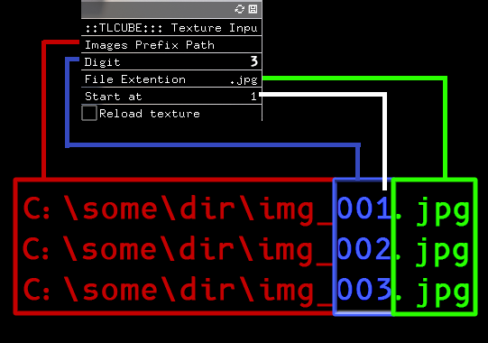

# TLCube

Tool to manipulate set of images as texture3d with fragment shader.

## Example

## Installation 
Download binaries for Windows.
Run the Exe.

Maybe one day cross compilation in Linux and MacOs I promise.

I'm actually not expert in cross compilation, so if you have any tips / tutorial / resource to share on this subject, I'll be more than happy.

## Usage

* Download the zip on the release page and unzip it somewhere.
* Run the executable.
* Use the Gui to reach the set of image you want to use.

* Open the `bin/shader.fragment` with any editor and modify it.
* To apply change, just click on the running program

## ToDo (maybe one day :p ) 

* Integrated ui to modify shader (is it really needed ?)
* Export result as Image / Video / Gif
* Better Texture Loader